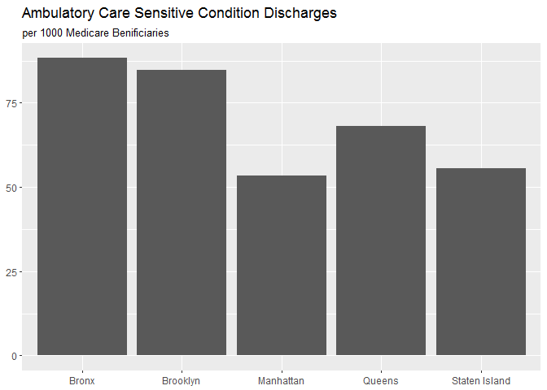
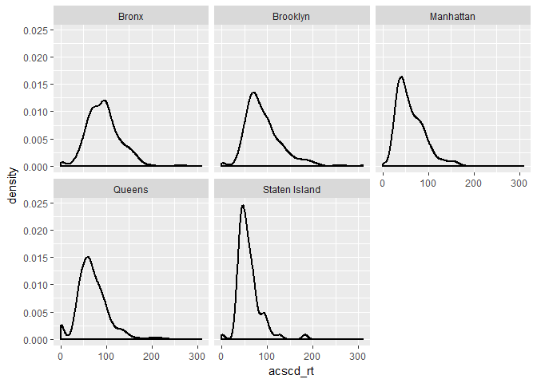
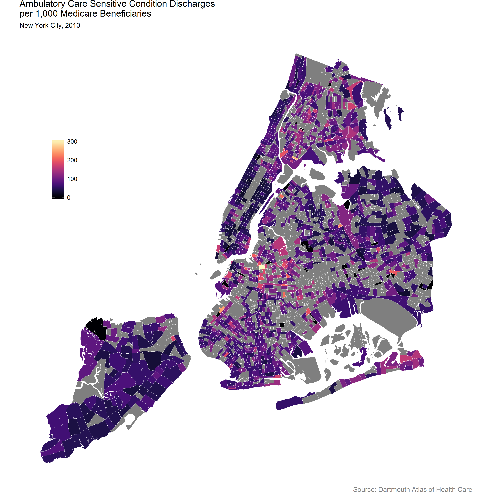

Explore Dartmouth Data
================
2016-11-24

``` r
# Install packages if needed
package_list <- c("tidyverse", "stringr", "foreign", "ggmap", "tigris", "raster", "maptools", "viridis", "rmarkdown", "knitr")
new_packages <- package_list[! package_list %in% installed.packages()[,"Package"]]
if(length(new_packages)) install.packages(new_packages)

library(tidyverse) # for tidy data manipulation
library(stringr) # for string manipulation
# library(janitor) # for handy data cleaning tools
library(foreign) # For reading in DBF files
library(ggmap) # for additional ggplot2 themes (eg. theme_map)
library(tigris) # for downloading census shapefiles
# library(rgeos) # for handling spatial data
library(raster) # for erase function to clip tracts to shoreline (erase water)
library(maptools) # for manipulating spatial data
library(viridis) # for color palletes
```

``` r
dart_raw <- read.dbf("../dropbox/capstone/data/raw/t_103113_1.dbf", as.is = TRUE)
names(dart_raw) <- names(dart_raw) %>% str_to_lower()
```

``` r
dart_nyc <- 
  dart_raw %>% 
  as_data_frame() %>% 
  filter(county %in% c("36005", "36047", "36061", "36081", "36085")) %>% 
  transmute(
    geoid = str_c(county, tract),
    boro = recode(county, 
            "36005" = "Bronx", "36047" = "Brooklyn", "36061" = "Manhattan", 
            "36081" = "Queens", "36085" = "Staten Island"),
    medicare_denom = tbene_n10,
    medicare_acscd = tacs_10
  ) %>% 
  mutate_if(is.double, funs(if_else(. %in% c(-99, -999), NA_real_, .))) %>% 
  mutate(
    acscd_rt = if_else(medicare_denom != 0, (medicare_acscd / medicare_denom)*1000, NA_real_)
  )

head(dart_nyc)
```

    ## # A tibble: 6 × 5
    ##         geoid  boro medicare_denom medicare_acscd  acscd_rt
    ##         <chr> <chr>          <dbl>          <dbl>     <dbl>
    ## 1 36005000100 Bronx              0              0        NA
    ## 2 36005000200 Bronx            159             NA        NA
    ## 3 36005000400 Bronx            240             20  83.33333
    ## 4 36005001600 Bronx            405             48 118.51852
    ## 5 36005001900 Bronx            134             14 104.47761
    ## 6 36005002000 Bronx            412             47 114.07767

``` r
dart_nyc %>% summarise_if(is.double, funs("miss_pct" = sum(is.na(.)) / n()))
```

    ## # A tibble: 1 × 3
    ##   medicare_denom_miss_pct medicare_acscd_miss_pct acscd_rt_miss_pct
    ##                     <dbl>                   <dbl>             <dbl>
    ## 1             0.008302583               0.3851476          0.398524

``` r
dart_nyc %>% 
  filter(!is.na(acscd_rt)) %>% 
  group_by(boro) %>% 
  summarise(acscd_rt = sum(medicare_acscd) / sum(medicare_denom) * 1000) %>% 
  ggplot(aes(boro, acscd_rt)) +
  geom_col() +
  labs(
    title = "Ambulatory Care Sensitive Condition Discharges",
    subtitle = "per 1000 Medicare Benificiaries"
  ) +
  theme(
    axis.title.x = element_blank(), 
    axis.title.y = element_blank()
  )
```



``` r
dart_nyc %>% 
  filter(!is.na(acscd_rt)) %>% 
  ggplot(aes(x = acscd_rt)) +
  geom_density(size = 1) +
  facet_wrap(~ boro)
```



``` r
boros <- c("005", "047", "0061", "081", "085")
tracts <- tigris::tracts(state = "36", county = boros, year = 2012)

erase_water <- function(cnty){
  water <- area_water(state = "36", county = cnty, year = 2012)
  tracts <<- raster::erase(tracts, water)
}

walk(boros, erase_water) # not sure about warnings of too few points (doesn't seem like issue ...yet)

tracts_df <-
  fortify(tracts, region = "GEOID") %>% 
  left_join(dart_nyc, by = c("id" = "geoid"))
```

``` r
p <-
  tracts_df %>% 
  ggplot(aes(x= long, y = lat, group = group, fill = acscd_rt)) +
  geom_polygon() +
  geom_polygon(fill = NA, color = "white", size = 0.10) +
  coord_map() +
  viridis::scale_fill_viridis() +
  theme_nothing(legend = TRUE) +
  labs(
    title = "Ambulatory Care Sensitive Condition Discharges \nper 1,000 Medicare Benificiaries",
    subtitle = "New York City, 2010",
    fil = "",
    caption = "Source: Dartmouth Atlas of Health Care"
  ) +
  theme(
    legend.title = element_blank(),
    legend.position = c(.1, .7),
    plot.caption = element_text(colour = "grey50")
  )

ggsave("acsc_map.png", p, width = 10, height = 10, units = "in")
```

------------------------------------------------------------------------



------------------------------------------------------------------------
